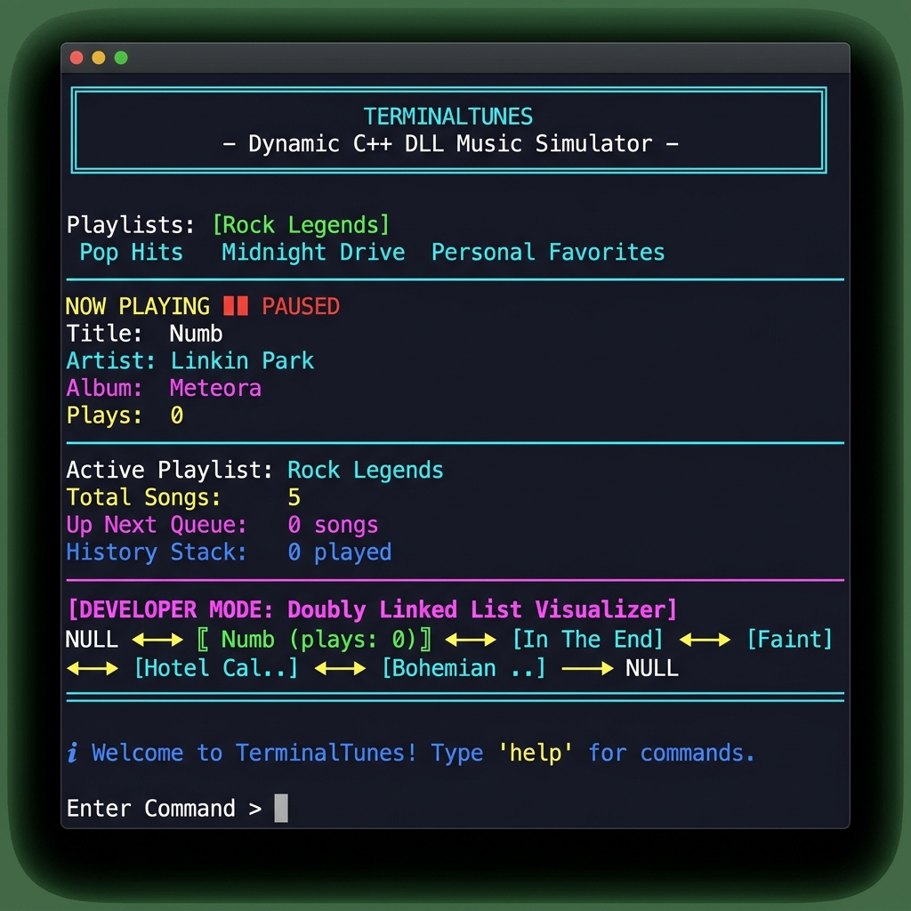
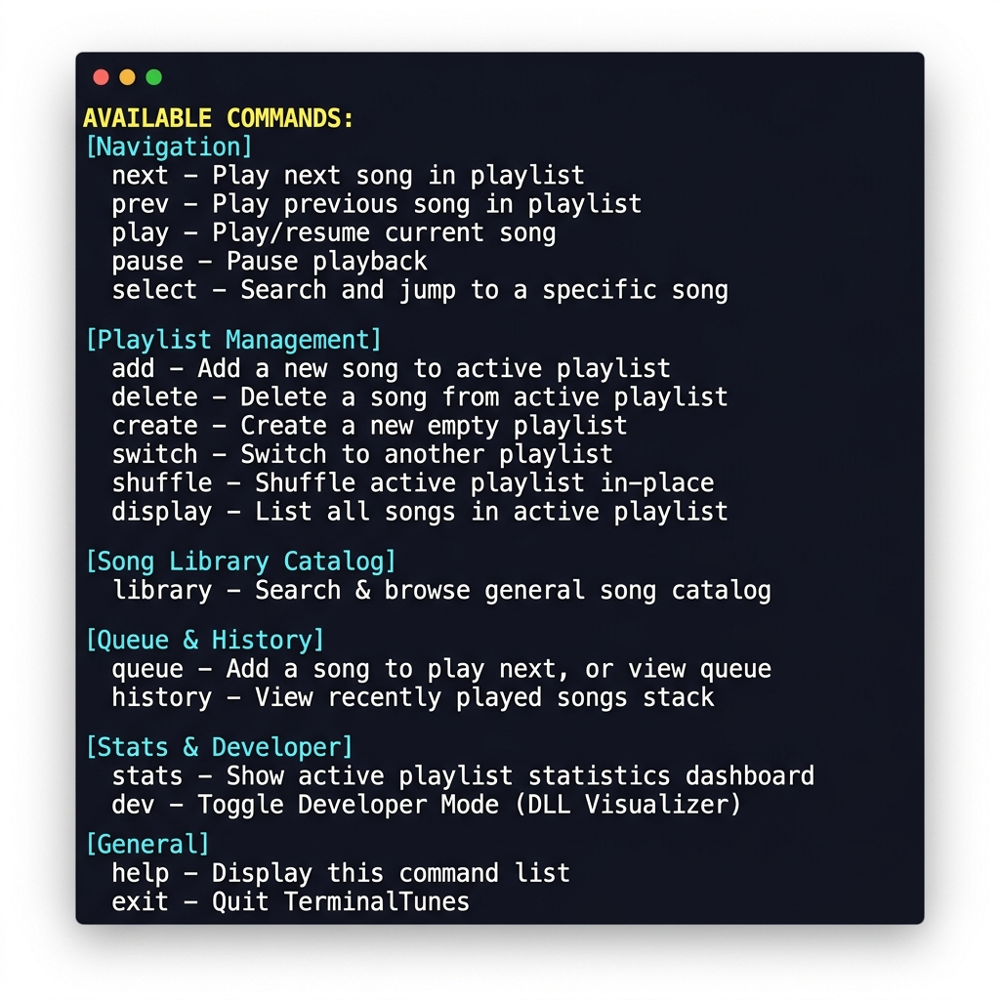
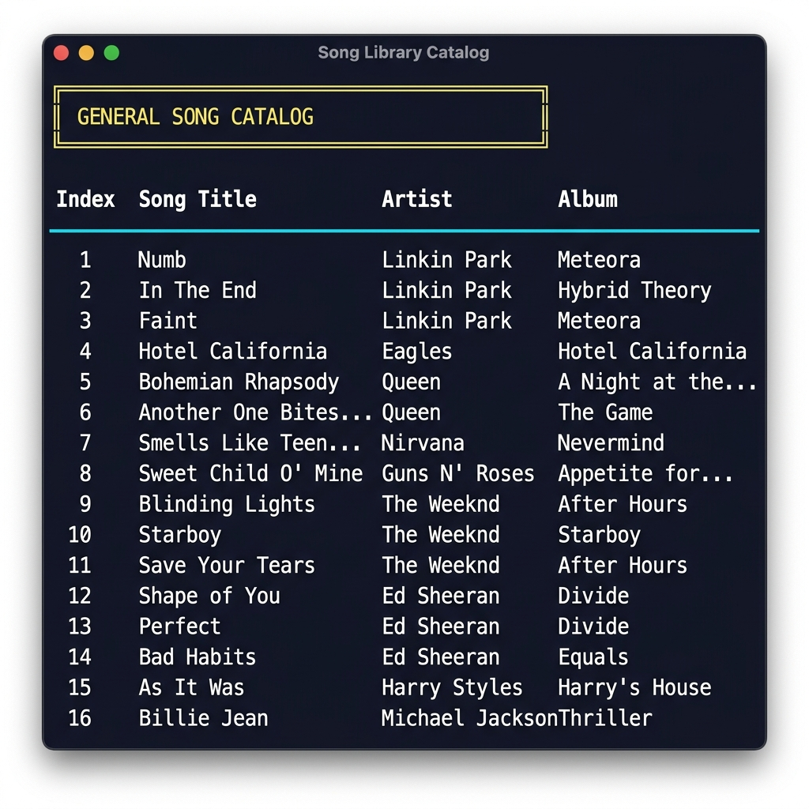
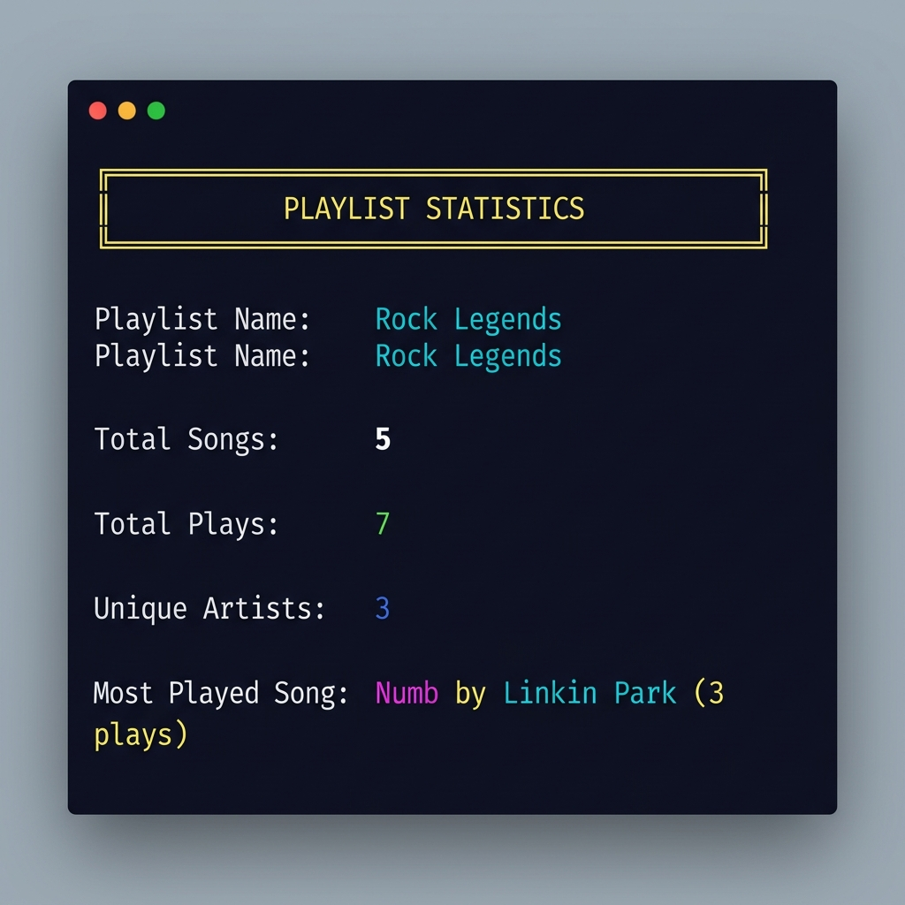
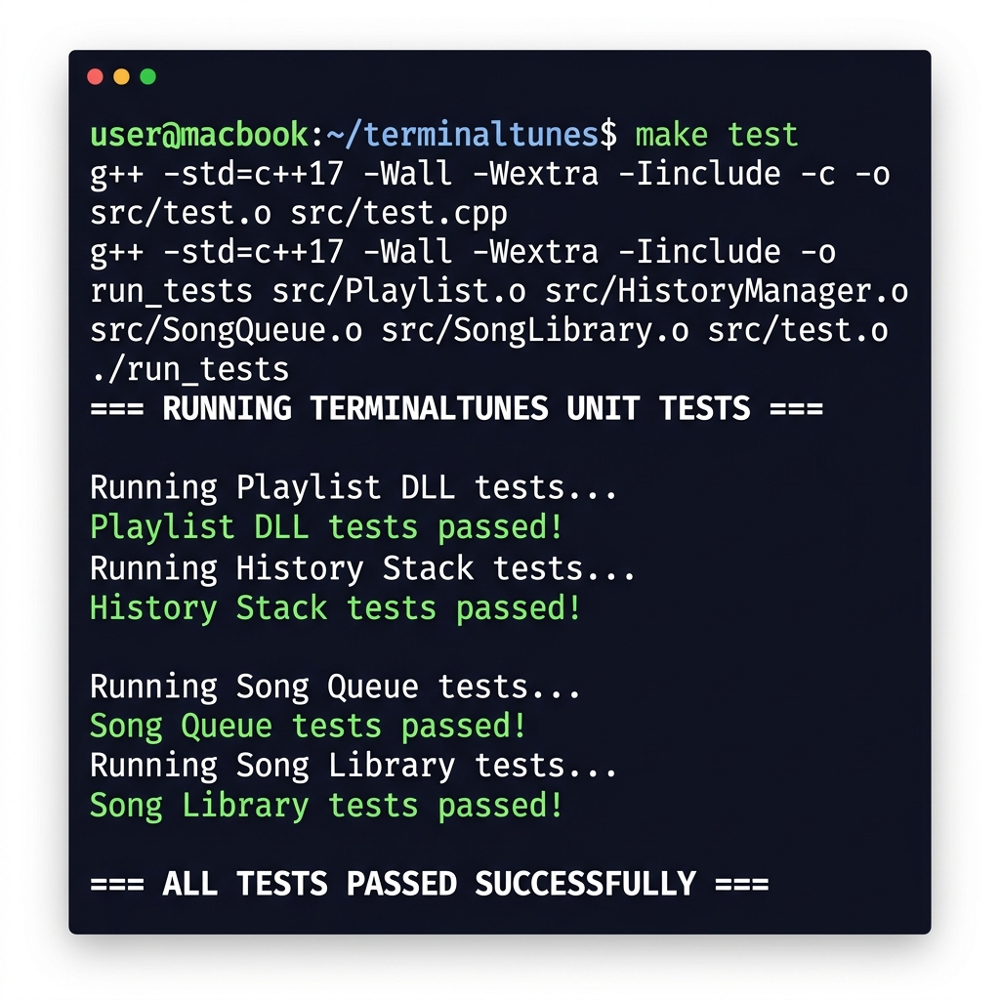

# 🎵 TerminalTunes

> A colorful terminal-based music playlist management system built in **C++17**, designed to demonstrate Data Structures and Algorithms concepts through an engaging, real-world simulation.

---

## 📸 Screenshots

### Main Dashboard with DLL Visualizer


### Help Menu — All Available Commands


### General Song Library Catalog


### Playlist Statistics Dashboard


### Unit Tests — All Passing


---

## ✨ Features

| Feature | Description |
|---|---|
| 🎧 **Multiple Playlists** | Create, switch, and manage separate playlists (Rock Legends, Pop Hits, etc.) |
| ⏭️ **Song Navigation** | Move forward/backward through songs in **O(1)** using DLL `next`/`prev` pointers |
| 📚 **General Song Library** | Browse and search a preloaded catalog of 24 songs across genres, and add them to any playlist |
| 🔀 **Shuffle Mode** | In-place Fisher-Yates shuffle that rebuilds DLL linkages |
| 📜 **Listening History** | Custom **Stack** (Singly Linked List) tracking recently played songs (LIFO) |
| 🎶 **Song Queue** | Custom **Queue** (Singly Linked List) for queueing up next songs (FIFO) |
| 📊 **Statistics Dashboard** | View total songs, total plays, unique artists, and most played track |
| 🔧 **Developer Mode** | Live visualization of the internal Doubly Linked List structure with pointer states |
| 🎨 **Colorful Terminal UI** | ANSI colors, box-drawing characters, and Unicode symbols for a polished look |

---

## 🏗️ Project Architecture

```
TerminalTunes
│
├── Playlist Manager
│     ├── Playlist (Doubly Linked List)
│     ├── Song Nodes (DLL Nodes)
│     └── Navigation Engine (next/prev in O(1))
│
├── Song Library (Preloaded Catalog + Search)
│
├── History Manager (Custom Stack — Singly Linked List)
│
├── Song Queue (Custom Queue — Singly Linked List)
│
├── Statistics Engine
│
├── Shuffle Manager (Vector + Fisher-Yates + DLL Rebuild)
│
└── Terminal UI (ANSI Colors + Box Drawing)
```

---

## 📂 Repository Structure

```
dsa-sem2-project/
│
├── include/                    # Header files
│   ├── Song.h                  # Song node (DLL node) definition
│   ├── Playlist.h              # Playlist manager (DLL operations)
│   ├── SongLibrary.h           # General song catalog definition
│   ├── HistoryManager.h        # Custom Stack definition
│   ├── SongQueue.h             # Custom Queue definition
│   └── UI.h                    # Terminal UI rendering
│
├── src/                        # Implementation files
│   ├── Playlist.cpp            # DLL insert, delete, search, shuffle
│   ├── SongLibrary.cpp         # Preloaded 24-song catalog + search
│   ├── HistoryManager.cpp      # Custom Stack (push, pop, history)
│   ├── SongQueue.cpp           # Custom Queue (enqueue, dequeue)
│   ├── UI.cpp                  # ANSI rendering, DLL visualizer
│   ├── main.cpp                # Application loop & command router
│   └── test.cpp                # Automated unit tests
│
├── screenshots/                # Output screenshots for documentation
│
├── Makefile                    # Build configuration
├── .gitignore                  # Ignored build artifacts
├── agents.md                   # Project specification
└── README.md                   # This file
```

---

## 🛠️ Build & Run Instructions

### Prerequisites
- **g++** with C++17 support
- macOS / Linux terminal

### Build the Application
```bash
make
```

### Run TerminalTunes
```bash
./terminal_tunes
```

### Run Automated Tests
```bash
make test
```

### Clean Build Artifacts
```bash
make clean
```

---

## 📋 Command Reference

| Command | Action |
|:---:|---|
| `play` | Play/resume the current song |
| `pause` | Pause playback |
| `next` | Play next song (checks Queue first, then DLL `next` pointer) |
| `prev` | Play previous song (DLL `prev` pointer) |
| `select` | Search for a song by title and jump to it |
| `add` | Add a song — pick from the **General Library** or enter manually |
| `delete` | Delete a song — current song or by title |
| `library` | Search & browse the preloaded General Song Library catalog |
| `create` | Create a new empty playlist |
| `switch` | Switch to another playlist |
| `shuffle` | Shuffle the active playlist in-place |
| `display` | List all songs in the active playlist |
| `queue` | Add a song to the next-up queue / view queue |
| `history` | View recently played songs (Stack — LIFO) |
| `stats` | Show playlist statistics dashboard |
| `dev` | Toggle Developer Mode (DLL Visualizer) |
| `help` | Show available commands |
| `exit` | Quit TerminalTunes |

---

## 🧠 Data Structures Used

### 1. Doubly Linked List — `Playlist`

Each playlist is a **Doubly Linked List** where every node is a `Song`. This allows:
- **O(1)** navigation forward (`next`) and backward (`prev`)
- **O(1)** insertion at beginning/end and deletion when node reference is known
- **O(n)** linear search by title

```cpp
class Song {
public:
    string title;
    string artist;
    string album;
    int playCount;
    Song* prev;   // Pointer to previous song
    Song* next;   // Pointer to next song
};
```

```
NULL ◀──▶  Numb  ◀──▶ [In The End] ◀──▶ [Faint] ──▶ NULL
```

### 2. Custom Stack — `HistoryManager`

Listening history is stored in a **custom Stack** implemented using a **Singly Linked List** (not `std::stack`). Songs are pushed when played and can be viewed in LIFO order.

```cpp
struct HistoryNode {
    string title;
    string artist;
    HistoryNode* next;
};
```

### 3. Custom Queue — `SongQueue`

The upcoming song queue is a **custom Queue** implemented using a **Singly Linked List** with `front` and `rear` pointers (not `std::queue`). Songs are enqueued to play next and dequeued in FIFO order.

```cpp
struct QueueNode {
    string title;
    string artist;
    QueueNode* next;
};
```

### 4. Vector — Shuffle Support

Shuffling copies DLL node pointers into a `std::vector`, applies Fisher-Yates shuffle via `std::shuffle`, then rebuilds the DLL linkages in-place.

---

## ⏱️ Time Complexity Analysis

| Operation | Data Structure | Complexity |
|---|---|:---:|
| Play Next Song | Doubly Linked List | **O(1)** |
| Play Previous Song | Doubly Linked List | **O(1)** |
| Insert at Beginning/End | Doubly Linked List | **O(1)** |
| Delete Current Node | Doubly Linked List | **O(1)** |
| Search Song by Title | Doubly Linked List | **O(n)** |
| Display All Songs | Doubly Linked List | **O(n)** |
| Shuffle Playlist | Vector + DLL Rebuild | **O(n)** |
| Push to History | Custom Stack (SLL) | **O(1)** |
| Pop from History | Custom Stack (SLL) | **O(1)** |
| Enqueue Song | Custom Queue (SLL) | **O(1)** |
| Dequeue Song | Custom Queue (SLL) | **O(1)** |
| Search Library Catalog | Vector (Linear) | **O(n)** |

---

## 🧪 Testing

Automated unit tests cover all core data structures:

- ✅ **Playlist DLL** — insert at beginning/end/middle, delete current/by-title, navigation, pointer integrity
- ✅ **History Stack** — push, pop, LIFO ordering, size tracking, empty checks
- ✅ **Song Queue** — enqueue, dequeue, FIFO ordering, size tracking, empty checks
- ✅ **Song Library** — catalog loading (24 songs), case-insensitive search, empty query, no-match query

Run the tests:
```bash
make test
```

---

## 🎓 DSA Concepts Demonstrated

This project demonstrates a strong understanding of:

- **Doubly Linked Lists** — Bidirectional traversal, pointer manipulation, dynamic insertion/deletion
- **Custom Stack Implementation** — Singly linked list-based LIFO structure without using STL
- **Custom Queue Implementation** — Singly linked list-based FIFO structure without using STL
- **Memory Management** — Proper `new`/`delete` usage, destructors cleaning up all dynamically allocated nodes
- **Pointer Manipulation** — Careful handling of `prev`/`next`/`head`/`tail`/`current` pointers
- **Time Complexity Analysis** — Achieving O(1) for navigation and insertion where possible
- **Object-Oriented Programming** — Clean class hierarchy, encapsulation, single responsibility
- **In-Place Shuffling** — Fisher-Yates shuffle on pointer vector with DLL reconstruction

---

## 👨‍💻 Author

**Danish Shaikh**

---

## 📄 License

This project was developed as an academic DSA project for Semester 2.
